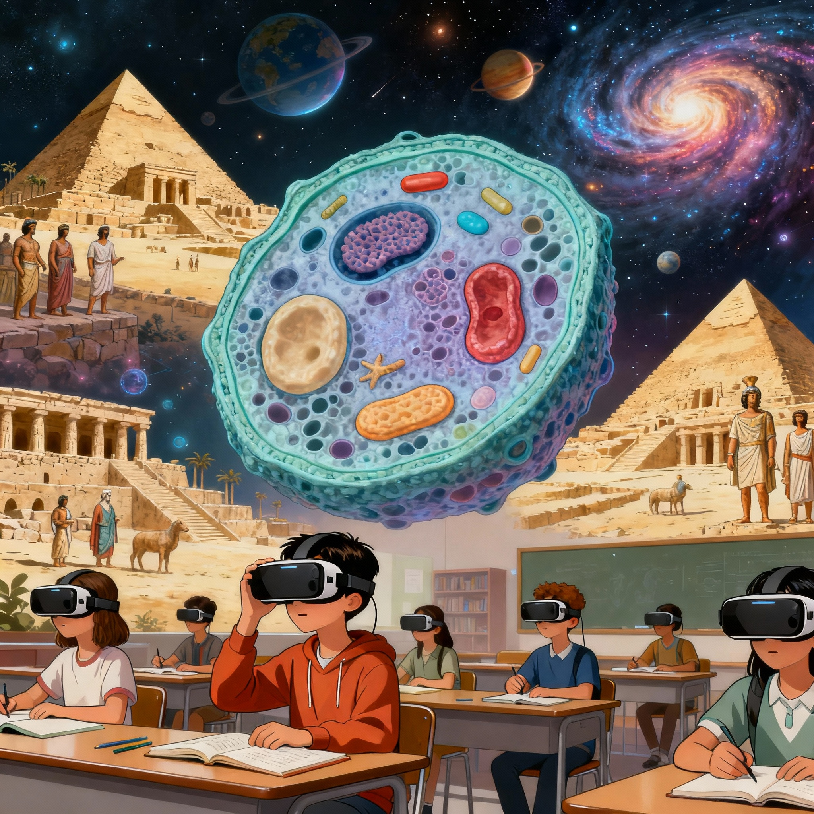
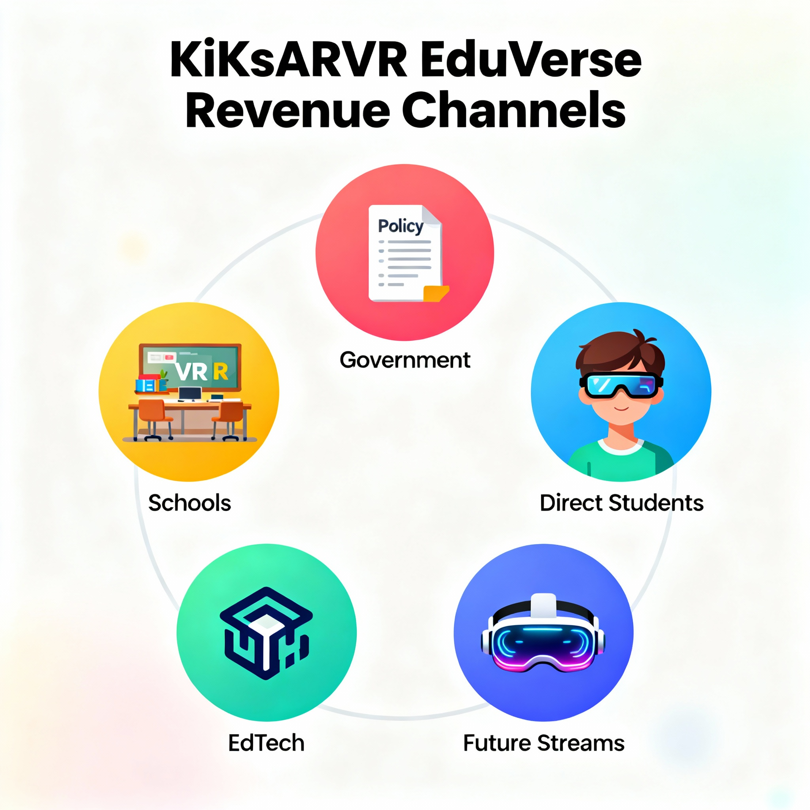
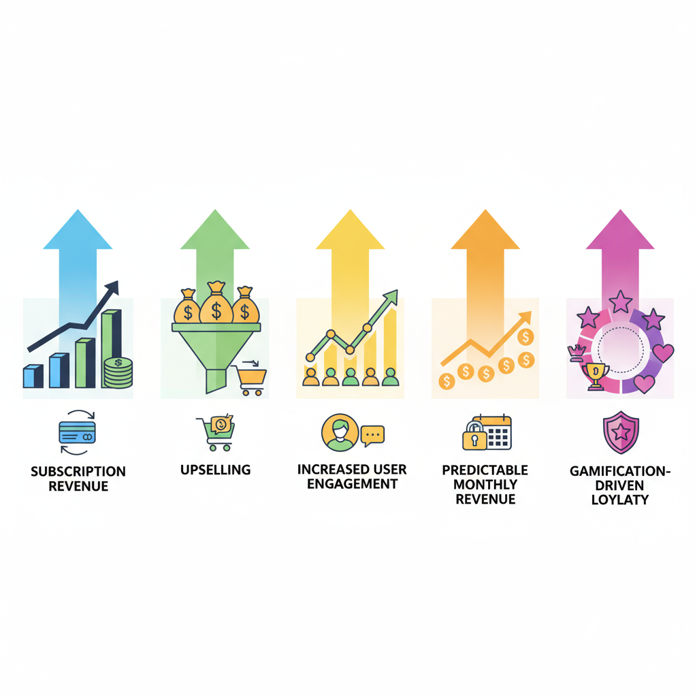

# Case study
## 🎓 KiKsARVR EduVerse — Immersive VR Learning Experience  

**KiKsARVR EduVerse** is a Virtual Reality (VR) learning platform designed to transform traditional education into an immersive, interactive experience. The goal is to help students understand complex subjects — like science, history, and geography — through **3D visualization**, **gamified learning**, and **experiential storytelling**.  

> ✨ KiKsARVR EduVerse reimagines the future of education — where knowledge isn’t just reading, it’s an experience.

---

## 💭 The Story – The Spark  
<table>
<tr>
<td width="50%" align="center" valign="middle">

</td>
<td width="60%" valign="top">

### 🎒 The Observation  

While observing classroom environments, I noticed a common challenge — students were memorizing facts they didn’t truly understand.  
Their notebooks were filled with notes, but their eyes lacked curiosity. Theoretical lessons often failed to translate into real understanding.  

> In a typical science class, when the teacher explained “the human digestive system,” students could name the organs — but few truly understood *how* they worked together.  
> The problem wasn’t intelligence — it was imagination.  

</td>
</tr>
</table>

---

<table>
<tr>
<td width="50%" align="center" valign="middle">

</td>
<td width="60%" valign="top">

### 💡 The Innovation 

That’s when I asked myself:  

> “What if students could *walk inside a human cell*?  
> What if *history wasn’t a chapter*, but a place they could *visit and explore*?”  

That question became the foundation of **KiKsARVR EduVerse** —  
a world where *education and imagination finally meet*, and every subject becomes a **living experience**.  

</td>
</tr>
</table>

---

## ✨ Key Features  

- 🧍‍♂️ **3D Immersive Lessons** — Explore subjects like Science, History, and Geography in lifelike 3D environments.  
- 🎮 **Interactive Learning Modules** — Drag-drop puzzles, VR experiments, and touch-based exploration for active engagement.  
- 🧑‍🏫 **Teacher Dashboard** — Enables teachers to guide, control, and assess student progress in real time.  
- 🏆 **Gamified Progress Tracking** — Earn badges, unlock levels, and compete in quiz challenges.  
- 💬 **AI Learning Assistant** — Voice-based chatbot to explain lessons and guide navigation.  
- 👓 **AR Mode (Mobile)** — Allows students without VR headsets to experience lessons through Augmented Reality.  

---

## 🧩 Prototype Flow  

1. **Home Dashboard** → Personalized profile with subject recommendations.  
2. **Subject Selection** → Choose a topic like “Human Digestive System” or “Mughal Empire.”  
3. **Immersion Mode** → Step into a fully 3D world and interact with each element.  
4. **Interactive Exploration** → Learn through observation, voice input, or tactile gestures.  
5. **Quiz Challenge** → Test knowledge with gamified, real-time feedback.  
6. **Progress Summary** → View performance, badges, and teacher feedback.  

> ### Sample prototype demo: [Link](https://raguram-n.github.io/kiksarvr-EduVerse/)

---

## 💡 Benefits  

- 📈 **Better Understanding** – Concepts become visual and tangible, improving comprehension.  
- 🎯 **Higher Engagement** – Gamified and interactive experiences boost interest and focus.  
- 🧠 **Improved Retention** – Visual learning creates stronger memory connections.  
- 🧑‍🏫 **Empowered Teachers** – Simplifies complex topics and classroom management.  
- 🌍 **Inclusive Learning** – AR Mode makes immersive learning affordable for rural schools.  

---

## 🎯 Target Audience  

**KiKsARVR EduVerse** is designed for learners, educators, and institutions who believe education should be *experienced*, not memorized.  

<table>
<tr>
<td width="50%" align="center" valign="middle">
  

</td>
<td width="60%" valign="top">

### 👧 Students (Ages 8–16)  
- Focused on upper primary and secondary school students.  
- Ideal for subjects that require visualization — biology, physics, geography, and history.  
- Encourages curiosity, confidence, and deep conceptual understanding.  

### 🏫 Schools & Teachers  
- Equips schools with an innovative, NEP 2020-aligned digital ecosystem.  
- Teacher dashboards simplify monitoring and engagement.  
- Makes learning measurable, visual, and participatory.  

### 🧩 EdTech Companies & Learning Partners  
- Ready-to-integrate VR/AR modules for educational publishers and learning platforms.  
- Enables partnerships for subject-based VR content and interactive assessments.  

### 🏛️ Government & Educational Boards  
- Supports **Digital India** and **NEP 2020** initiatives promoting tech-based education.  
- Offers low-cost AR options for rural and semi-urban schools to bridge the digital divide.  

</td>
</tr>
</table>

---

## 📊 Market Opportunity  

The global shift toward **immersive education** presents a massive opportunity for KiKsARVR EduVerse.  

- 🌍 The **EdTech & Smart Classroom Market** is projected to reach **$232 billion by 2027**.  
- 🥽 The **VR in Education sector** is growing at **over 40% CAGR**, fueled by affordable hardware and rising digital adoption.  
- 🇮🇳 India’s **NEP 2020** encourages experiential, skill-based learning — a perfect foundation for EduVerse.  
- 🧒 With **250+ million students** and expanding digital infrastructure, India is one of the fastest-growing EdTech ecosystems.  
- 🌐 **Affordable VR headsets and smartphone-based AR** lower accessibility barriers, enabling scalable deployment across schools.  

> 📈 EduVerse is not just aligned with the market — it’s positioned to *lead* the transformation of classroom learning in the digital era.  

---

## 💰 Revenue Opportunities  

<table>
<tr>
<td width="50%" align="center" valign="middle">

</td>
<td width="60%" valign="top">

**KiKsARVR EduVerse** follows a scalable and multi-channel revenue model that aligns with both educational impact and business sustainability.  

### 🧭 1. B2B Model — Institutional Partnerships  
- 🏫 **School Subscriptions (Annual Licensing)** — Per-student or per-classroom subscription for VR/AR modules.  
- 🎒 **Smart Classroom Packages** — Bundled VR-ready kits (headsets + software) for schools.  
- 👩‍🏫 **Teacher Training Programs** — Paid certification for teachers on immersive learning pedagogy.  

### 🏛️ 2. B2G Model — Government & Board Integrations  
- 📘 **Curriculum Integration Contracts** — Partnerships with NCERT and State Boards for VR-based syllabus modules.  
- 🇮🇳 **Digital India / Samagra Shiksha** — Low-cost AR content for rural and government schools.  
- 💼 **CSR Collaborations** — Tie-ups with corporates funding digital education through CSR.  

### 👩‍💻 3. B2C Model — Direct-to-Student Subscriptions  
- 🎮 **Freemium App Model** — Free access to basic modules; premium lessons unlocked via subscription.  
- 🏆 **Gamified Learning Pass** — Competitive quizzes, badges, and certificates as part of a paid tier.  
- 🪄 **AR Revision Packs** — Micro-subscription for quick AR flashcard-based revisions.  

### 🤝 4. Strategic Collaborations  
- 💡 **EdTech Integrations** — White-label immersive modules for major learning platforms (BYJU’S, Vedantu, etc.).  
- 📦 **Content Licensing** — License subject-specific VR environments to other EdTechs.  
- 🥽 **Hardware Partnerships** — Preloaded content bundles with VR headset manufacturers.  

### 🌍 5. Future Revenue Streams  
- 🏪 **EduVerse Marketplace** — Platform for educators to upload and monetize custom VR lessons.  
- 🤖 **AI Tutor-as-a-Service (AITaaS)** — Licensing EduVerse’s AI learning assistant to other education platforms.  
- 📊 **Data Analytics Dashboard** — Subscription access for institutions to view engagement insights and learning analytics.  

</td>
</tr>
</table>

---

### 💹 Example Revenue Projection  

| Revenue Stream | Year 1 | Year 2 | Year 3 | Growth |
|----------------|--------|--------|--------|--------|
| School Subscriptions | ₹20L | ₹60L | ₹1.2Cr | 200% |
| Government Projects | ₹15L | ₹50L | ₹1Cr | 233% |
| B2C Subscriptions | ₹5L | ₹20L | ₹40L | 200% |
| EdTech Partnerships | ₹10L | ₹25L | ₹60L | 140% |
| **Total Estimated Revenue** | **₹50L** | **₹1.55Cr** | **₹3.2Cr** | — |

> 💡 *KiKsARVR EduVerse aims to blend purpose with profitability — empowering every learner while building a sustainable EdTech ecosystem.*  

---

## 🧰 Prototype Tech Stack  

| Layer | Tools / Technologies |
|-------|----------------------|
| **Design & Prototyping** | Figma, Blender, Adobe XD |
| **3D Development** | Unity 3D / Unreal Engine |
| **VR Integration** | Oculus SDK, WebXR API |
| **Backend** | Node.js, Firebase |
| **AI Assistant** | Dialogflow / OpenAI API |
| **AR Mode (Mobile)** | ARCore, ARKit |

---

<table>
<tr>
<td width="50%" align="center" valign="middle">

</td>
<td width="60%" valign="top">

## 🚀 Future Tech Scope  

- 🤖 **AI-Driven Adaptive Learning** – Lessons adapt based on student progress and performance.  
- 📚 **Curriculum Integration** – NCERT and State Board modules for standardized VR education.  
- 🌐 **Multi-Device Support** – Compatible with VR headsets, smartphones, and web browsers.  
- 🧑‍🤝‍🧑 **Collaborative VR Classrooms** – Group sessions for multiplayer exploration and teamwork.  
- 🗣️ **Voice & Gesture Controls** – Hands-free, intuitive navigation for immersive interaction.  

---

## 🧭 Feature Enhancement Scope  

- 🎙️ **Teacher Voice-Over Mode** – Live narration for guided VR sessions.  
- 👨‍👩‍👧 **Parent Dashboard** – Real-time student progress tracking and engagement insights.  
- 🪄 **AR Flashcards** – Quick lesson previews for revision without headsets.  
- 💫 **Offline Mode** – Downloadable modules for rural or low-internet regions.  

</td>
</tr>
</table>

---

## 📈 Research proof

- Conceptual Learning Gaps in Indian Education - [Link](https://github.com/Raguram-N/Eduverse-proof-1/blob/main/README.md)
- How Virtual Reality (VR) Enhances Concept Clarity in Education - [Link](https://github.com/Raguram-N/Eduverse-research-proof/blob/main/README.md) 

---

## 🏁 Conclusion

**KiKsARVR EduVerse** bridges the gap between *textbook theory* and *real-world imagination*, turning lessons into journeys students can **see, touch, and experience**.
By blending **UI/UX principles**, **AR/VR technologies**, and **AI personalization**, EduVerse turns every classroom into a world of exploration and wonder.  

> “The future of education isn’t on paper — it lives inside the experience.”  

---

### ✍️ Author  
**RAGURAM NARAYANASWAMY**  
QA | UX Research | Growth Strategy | Product Management

### 📂 Repo Purpose  
**Product Case Study & Growth Proposal for KiXR**  

---
